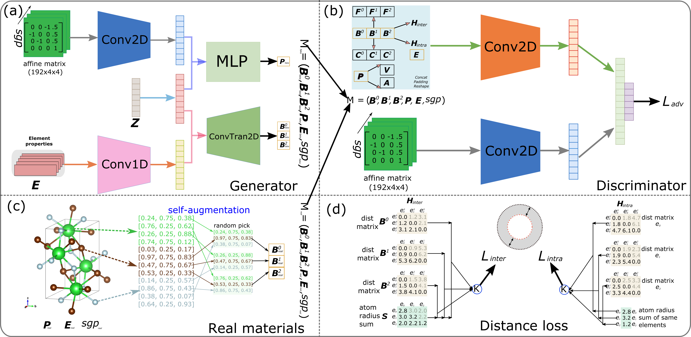

# PGCGM:
### Physics Guided Generative Adversarial Networks for Generations of Crystal Materials with High Symmetry Constraints



Created by Yong Zhao

## Introduction

This repository contains the implementation of generation code of PGCGM. If you want to run the code, you run it on `Colab`. The link is [PGCGM](https://colab.research.google.com/drive/1m9RZIRoHaAQLNKxyiowHA8YMXgR86p5P#scrollTo=s50VQhHyUKkB). You need to make sure install the dependencies and then download folders of `data` and `models` and python scripts of `model.py` and `simle_dist.py` to your google drive in this [files](https://drive.google.com/drive/folders/1LmQZ3HJXLXyhLiuFB4hFgylp_cSRGVwv).

### Running environment set up

we recommend that you build a virtural environment running the code. Below are steps that can install the dependent packages.

#### Create conda virtual environment and activate it
```
conda create -n blm
conda activate blm
```
If there is no pip installed, run below:
```
conda install pip
```

Install `pytorch` from [pytorch web](https://pytorch.org/get-started/previous-versions/) based on your python & cuda version. For example,
```
conda install pytorch==1.6.0 torchvision==0.7.0 cudatoolkit=10.2 -c pytorch
```
Install following packages using pip:
```
pip install pymatgen==2022.0.6
pip install scipy==1.6.0
pip install numpy==1.19.5
```
Once you install all those packages, you just run below script:
```
./sh/gen.sh
```
